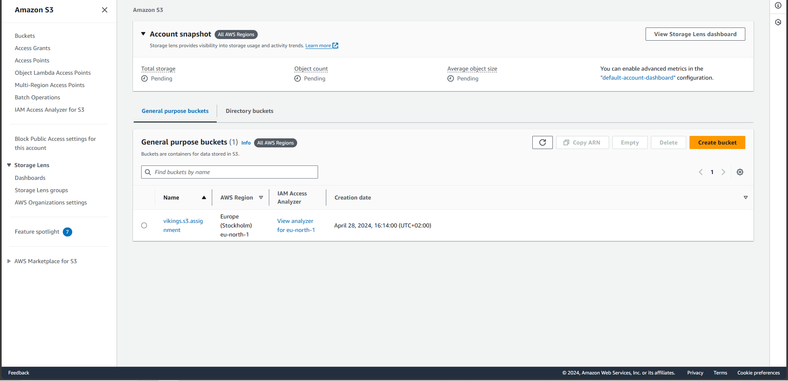
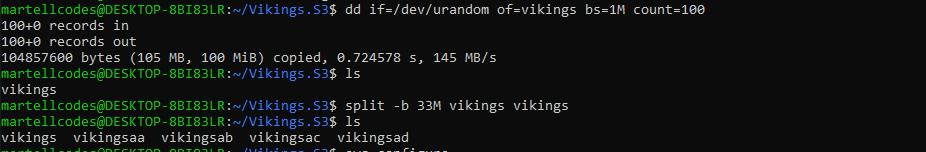
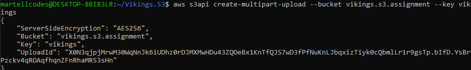
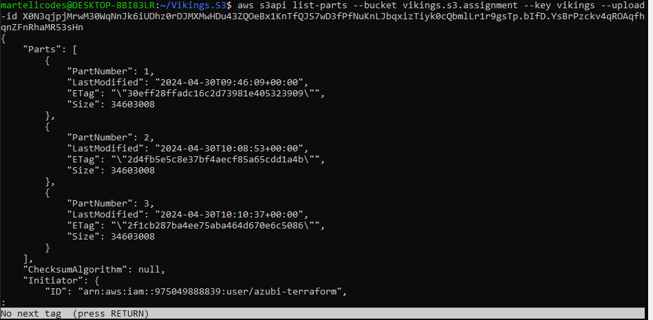
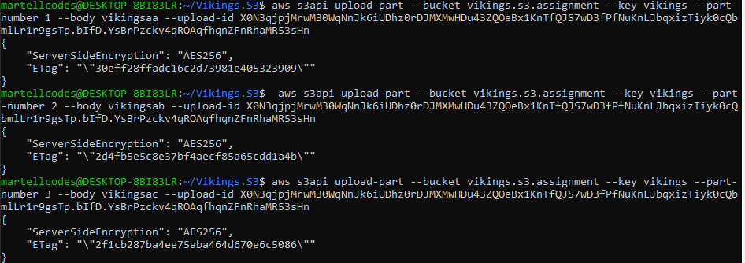
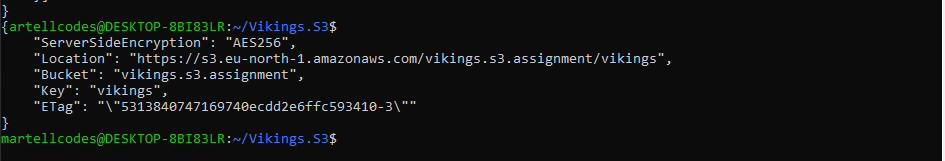

# AWS S3 Multipart Upload Assignment

 Instructions
### AWS S3 Multipart

***

#### In this assignment, you will get a chance to practice with AWS S3 and multi-part upload.
***
    
###### Create an S3 bucket to use for this assignment, a basic S3 bucket.
   

   Created a S3 bucket in AWS console named it Vikings.S3.Assignment


***
###### Optionally, generate a file that is at least 100MB  or use a file that is at least >100MB
###### Prepare the file by splitting it into three or more parts [screenshot].
   

   With the linux command line we created a random file with a 100mb size as seen in the image.
   ```bash
   dd if=/dev/urandom of=largefile bs=1M count=100
   ```

   We then split the file into 3 part of 33mb.
   ```bash
   split -b 33M largefile 
   ```
***

###### Initiate the multipart upload via the S3 api [screenshot].

   
   Initializing multi-part-upload using AWSCLI in Ubuntu.
   ```bash
   aws s3api create-multipart-upload --bucker vikings.s3.assignment --key vikings
   ```

***

###### Use the S3 api to list all the parts that are to be uploaded [ screenshot ]
   
   Listing part that are initialized for upload using s3api, list-part command and upload-id
   ```bash
   aws s3api list-parts --bucket viking.s3.assignment --key vikings --upload-id 
   ```
***
###### UPLOAD THE PARTS
>List all the uploaded parts
   

   List of the parts to be uploaded
   ```bash
    aws s3api upload-part --bucket vikings.s3.assignment --key vikings --part-number 1 --body vikingsaa --upload-id 
   ```
***
###### Complete the multipart upload and screenshot  the uploaded file.
   
   Multi-part-upload SUCCESSFULL
```bash
aws s3api complete-multipart-upload --multipart-upload file://vikings_Etag.json --bucket vikings.s3.assignment --key vikings --upload-id
```


<br>
<br>
Made ❤ with by VIKINGS of AZUBI...